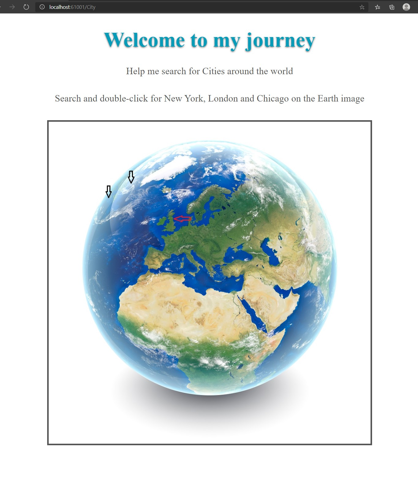
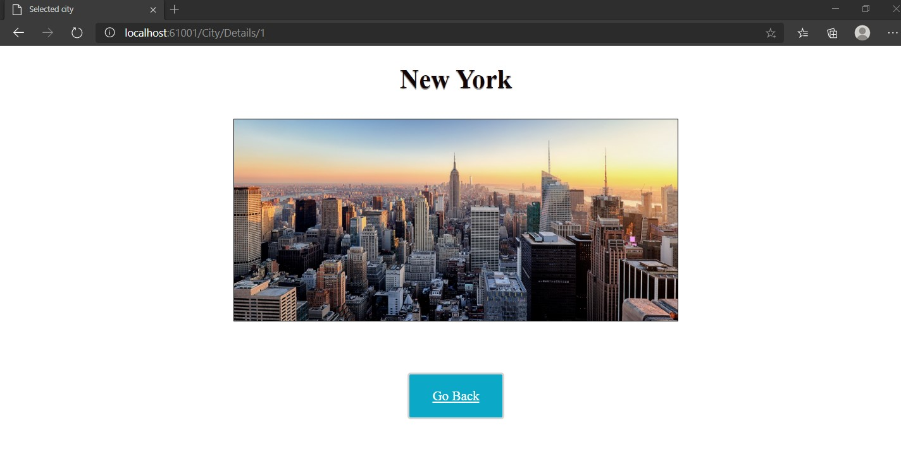

# Module 4: Developing Controllers

## Lab: Developing Controllers

1. **Nombres y apellidos:** Francisco Javier Moreno Quevedo
2. **Fecha:** 06/12/2020
3. **Resumen del Ejercicio:**  Añadir los componentes necesarios para hacer funcional la aplicacion de viajes 1/4
4. **Dificultad o problemas presentados y como se resolvieron:** Ninguna

- Ejercicio 1: Adding Controllers and Actions to an MVC Application.

  - Añadimos la carpeta Controllers
  
  - Añadimos en esta carpeta el controlador HomeController
  
  - Añadimos en esta carpeta el controlador CityController
  
  - En el **CityController**:
  
    - Añadimos los namespaces que necesitamos
  
    - En la accion index creamos el ViewData **"Page"**
  
    - Creamos la accion **Details**
  
      - creamos el ViewData **"Page"**
      - Le añadimos un parametro **id**
  
    - Creamos la accion **GetImage**
  
      - Le añadimos un parametro **cityId**
  
    - Añadimos dos campos **_data** de tipo **IData** y **_environment** de tipo **IHostingEnvironment** y 
  
    - Creamos el constructor de la clase **CityController** y le pasamos como parametros dos variables de tipo IData e IHostenvironment y se las asignamos a los campos que hemos creado
  
    - Añadimos codigo a las acciones **Details** y **GetImage**
  
      
  
  - En el **HomeController**
  
    - Cambiamos y en vez de que devuelva la vista lo redirijimos al controlador city accion index
  
    
  
  

